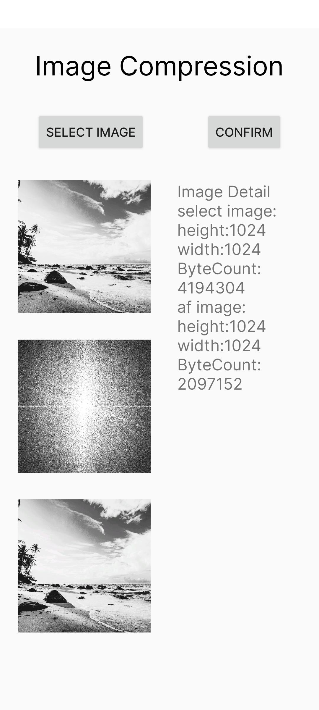

# DSP
My DSP homework  
我的数字信号处理作业  
使用Android Studio编写  
在软件里实现两个功能  
1.音频信号转频谱图（音乐可视化）  
2.图片经过二维离散傅里叶变换转到频率域的幅度谱，再通过裁切幅度谱，经过傅里叶逆变换达到压缩图片的目的  
  
ps：虽然安卓已经有很强的图片压缩算法：鲁班算法，但在此只是作为演示  

/matlab 为matlab利用fft压缩图片的代码

软件截图示例

